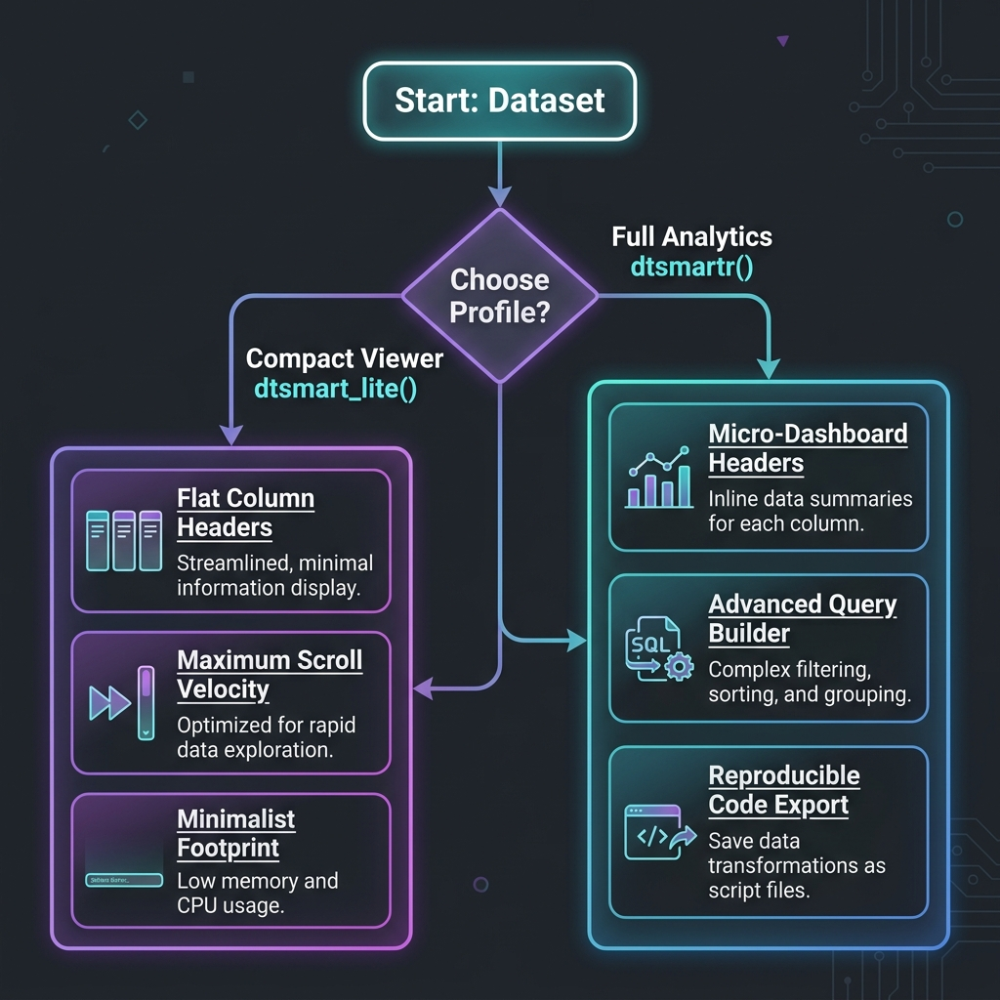

# dtsmartr 

> An interactive, ultra-responsive, and high-fidelity data explorer widget for clinical programming (CDISC SDTM/ADaM) and general R data frames, built on a virtualized React grid backend.

[](https://github.com/wagh-nikhil/dtsmartr/actions)
[](https://cran.r-project.org/package=dtsmartr)
[](https://opensource.org/licenses/MIT)

**dtsmartr** is a premium, Kaggle-style data browser package for R. Leveraging a virtualized React rendering engine and a custom Base64 Apache Arrow IPC serialization pipeline, it delivers instantaneous rendering and fluid scrolling on tables containing millions of cells—directly inside the RStudio/Positron Viewer pane, embedded in Shiny, or exported as offline-capable HTML reports.

---

### 🌐 Documentation & Live Website
For step-by-step installation guides, API reference sheets, and feature articles, visit our official documentation site:
👉 **[https://wagh-nikhil.github.io/dtsmartr/](https://wagh-nikhil.github.io/dtsmartr/)**

---

## 🏎️ Dual-Engine Profiles: Choose Your Mode

Depending on the scale of your dataset and analytical needs, `dtsmartr` offers two tailored frontend engines:



### 1. `dtsmartr()` — Full Analytics Mode (Default)
Enables the complete suite of analytical features, designed for deep exploration:
* **Micro-Dashboard Headers**: Live histograms, stacked categorical bars, and data completeness progress bars.
* **Insights Drawer**: Interactive SVG distribution histograms and Pareto charts.
* **Query Builder**: Multi-rule, nested Boolean logic filters (AND/OR).
* **Code Export**: Code generation for Base R, `dplyr`, SQL, and Apache Arrow.

### 2. `dtsmart_lite()` — Minimalist Viewer Mode
Forces a compact, ultra-clean grid layout optimized for raw scrolling performance and minimal memory footprint:
* **Flat Headers**: Hides distributions, progress bars, and stats from column headers to maximize visible grid space.
* **Analytics Disabled**: Hides the Advanced Query Builder, Insights Drawer, and Code Export controls.
* **High Refresh Rate**: Streamlines the DOM footprint to ensure maximum scrolling velocity on huge data structures.

---

## 🎨 Comprehensive Feature Matrix

### 🚀 Premium UX & UI Enhancements (v0.4.0)
* **Responsive Header & Row Density Modes**: Toggle header sizing (`≡ Min` / `≡ Auto` / `≡ Detail`) and row padding (`Compact` / `Standard` / `Comfort`) directly in the toolbar. Row height scales dynamically (24px → 32px → 40px), doubling screen layout capacity. Density modes can also be configured programmatically from R.
* **Smart Sparkline & Badge Sizing**: Low-variance, constant, and binary columns automatically display clean descriptive summary badges (`🔒 Constant`, `⚖️ CV`) or binary stacked bars instead of full histograms to maximize screen estate.
* **Collapsible Right-Sidebar Filter Drawer**: Replaces the blocking full-screen advanced filter modal with a 350px right-sidebar drawer. Features **Live Preview Highlighting** (rows matching draft rules highlighted in yellow in real-time) and live match counters.
* **Shift+Click Multi-Column Sorting**: Chain sort conditions directly by clicking headers (Shift+Click) showing priority badges (`1️⃣ ↑`, `2️⃣ ↓`) and a toolbar sort chain display.
* **Compact Toolbar Icon Buttons**: Replaced large text-based buttons with clean SVG icons for label toggle, filter sidebar, query code, and column picker.
* **Keyboard Shortcuts Cheatsheet**: Press `?` to open the overlay cheatsheet modal. Shortcuts include `Ctrl+F` for filter, `Ctrl+Shift+[` / `]` for density, and `Ctrl+Shift+F` to clear.

### 🆕 Grid Layout Enhancements (v0.3.0)
* **Interactive Column Freezing & Anchoring (⚓)**: Click the anchor symbol in any column header to freeze that column and all columns to its left. Sticky cells remain fixed on the left while you scroll horizontally.
* **Visual Freeze Divider**: Draws a prominent vertical blue line (`3px solid #3b82f6`) along the frozen boundary across the header and all body cells.
* **HTML5 Drag-and-Drop Column Reordering**: Grab any column header and drag it horizontally to reposition it dynamically. The virtualized body cells and headers rerender instantly.
* **Clean Control Isolation**: Separated sorting controls (`⇅`) from quick-filter popovers (`≡`) on header cards to prevent accidental clicks.

---

### 📊 Core Data Engine Features
* **Auto-Sniffing Data Badges**: Headers automatically identify and display data types (e.g., `#` for numeric, `a` for character, `L` for logical, `📅` for date-time).
* **Variable Metadata Label Overlays**: Automatically extracts R variable `label` attributes (highly common in CDISC SDTM/ADaM datasets) and renders them as clear sub-headers.
* **Advanced Boolean Query Builder (AND/OR)**: Build complex, nested filter conditions using searchable checkbox checklists for categorical variables, calendar pickers for date-time fields, and numeric range inputs.
* **Auto Text-Wrapping**: Text wraps neatly within cell boundaries to ensure complete data visibility without manual column widening.
* **Sticky Row Pinning (📌)**: Click any row to lock it to the top of the grid with a soft-gold highlight, keeping key subjects or records visible.

---

### 💻 Code Export & Ingestion
* **Universal Reproducible Code Generator**: Converts your interactive grid filters into copy-pasteable, production-ready code with a single click:
  - **Base R**: `df[df$AGE > 50 & df$SEX == "F", ]`
  - **dplyr**: `df %>% filter(AGE > 50, SEX == "F")`
  - **SQL**: `SELECT * FROM df WHERE AGE > 50 AND SEX = 'F'`
  - **Apache Arrow**: `df |> filter(AGE > 50) |> collect()`
* **`dtsmart_launch()` Data Ingestion Wizard**: Start a local uploader wizard to drag-and-drop local Excel, CSV, RDS, or SAS (`.sas7bdat`) files directly into the grid.
* **50,000+ Row Safety Guardrail**: Prevents IDE viewer pane freezes. If a dataset exceeds 50,000 rows during an interactive session, it automatically redirects the explorer to an external web browser.

---

## ⚙️ High-Performance Architecture Roadmap

Our serialization protocol is engineered for speed. In version `0.3.0`, `dtsmartr` transitioned to a high-speed **Apache Arrow IPC Binary Stream Serialization** pipeline:

```
[R Data Frame] 
    │
    ▼  (Apache Arrow C++ Engine)
[Arrow RecordBatch Stream]
    │
    ▼  (base64enc C-Library)
[Base64 Arrow IPC Payload] ---> Written directly into the HTMLWidget structure
                                    │
                                    ▼ (React App on Page Load)
                                [Uint8Array Decode]
                                    │
                                    ▼ (apache-arrow JS Library)
                                [Arrow Columnar Table]
                                    │
                                    ▼
                                [Virtualized Grid View]
```

* **Instant Load Times**: Replaces slow JSON formatting with a binary stream. Large datasets load up to 10x faster.
* **Columnar Layout Alignment**: Keeps columns stored sequentially in memory, enabling lightning-fast virtualized data projection and filtering.
* **Minimal Memory Overhead**: Eliminates the double-memory allocation typical of nested JSON arrays.

---

## 📦 Installation & Quick Start

### Installation
Install the package directly from GitHub using `remotes`:

```r
# Install remotes if needed
if (!requireNamespace("remotes", quietly = TRUE)) {
  install.packages("remotes")
}

# Install the latest dev version
remotes::install_github("wagh-nikhil/dtsmartr")
```

### Quick Start
Fire up the grid on standard datasets in one line:

```r
library(dtsmartr)

# 1. Full Analytics Mode (Default)
dtsmartr(mtcars)

# 2. Minimalist Viewer Mode (Clean, compact layout)
dtsmart_lite(iris, title = "Iris Compact View")

# 3. Custom configurations (Dark theme, pre-hidden variables)
dtsmartr(
  data = mtcars,
  options = dtsmartr_options(
    theme = "dark",
    hidden_columns = c("cyl", "hp"),
    na_string = "Missing"
  )
)
```

---

## 📄 License
Licensed under the [MIT License](LICENSE).
