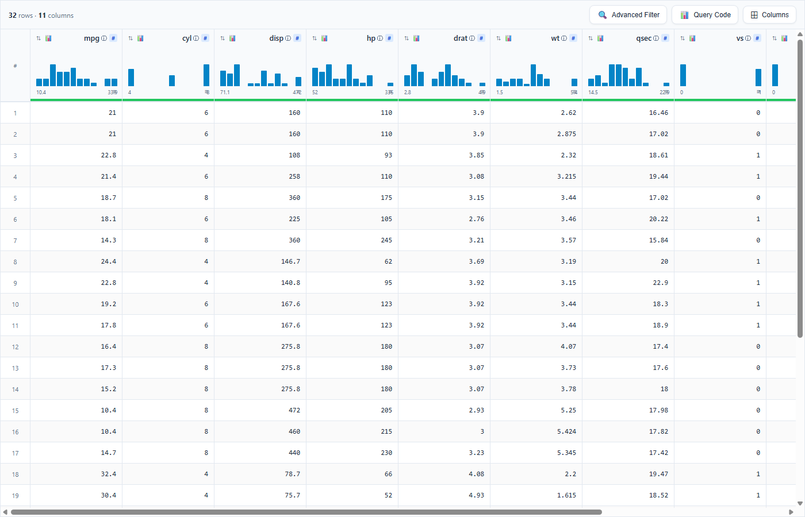
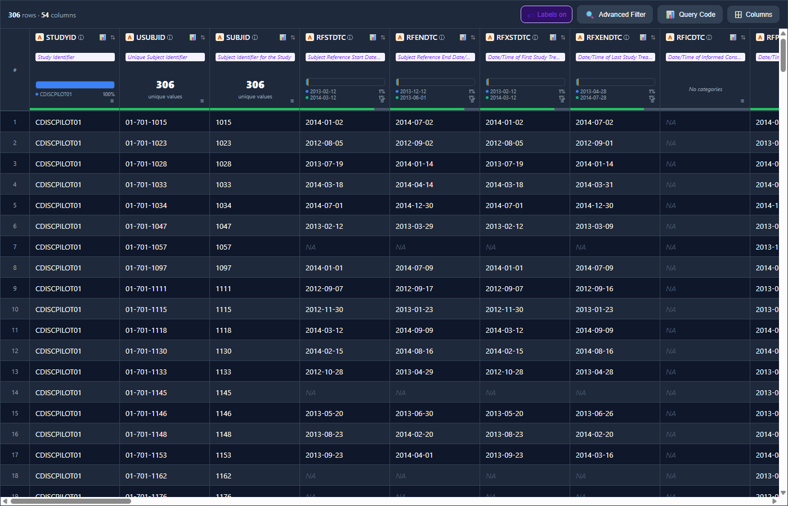
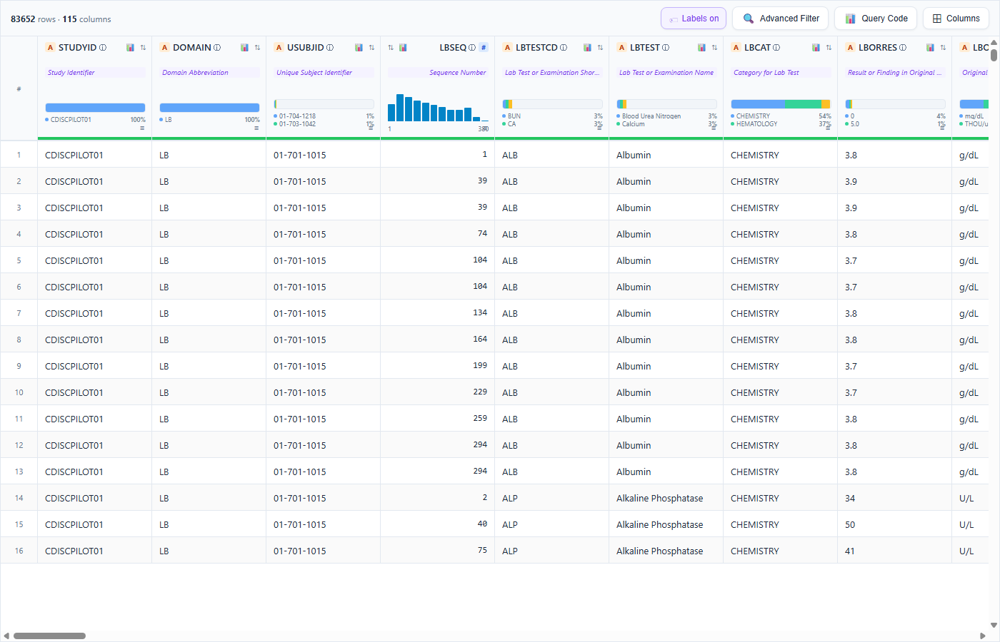
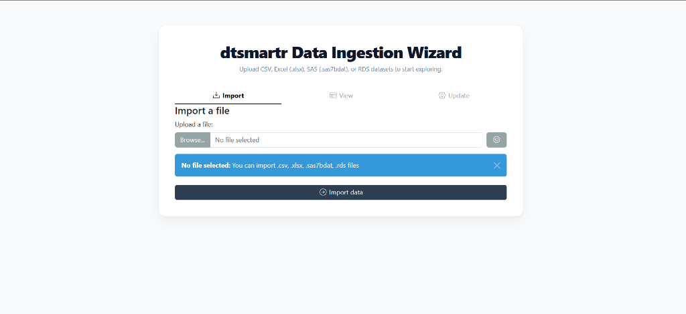
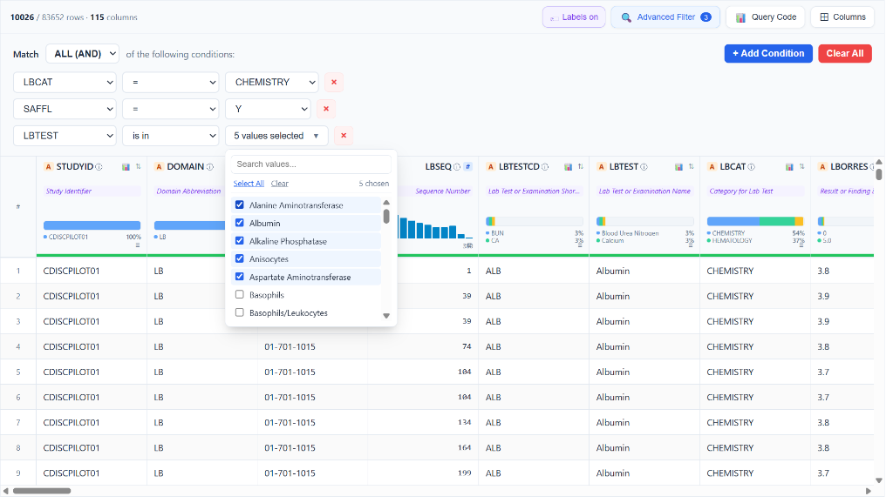
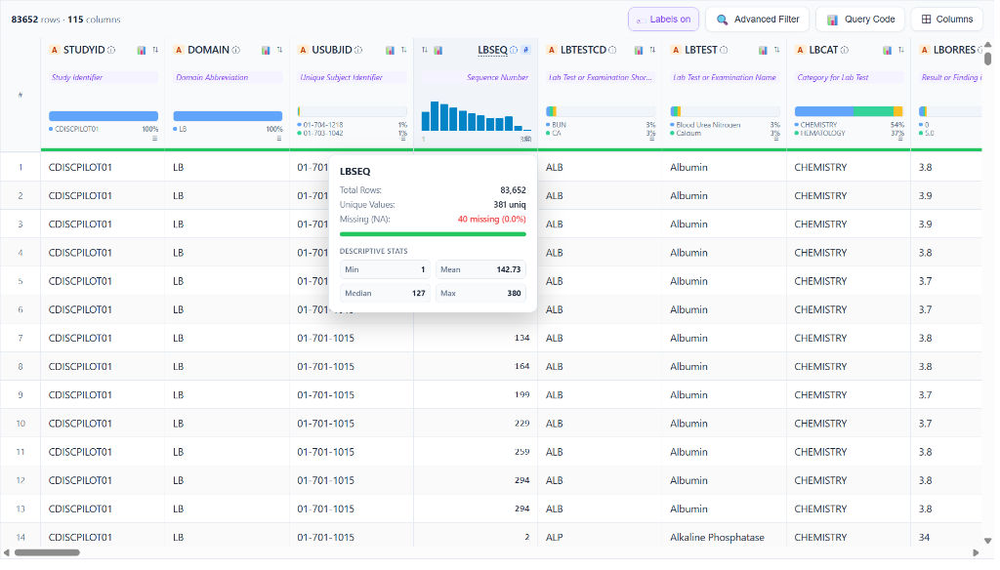
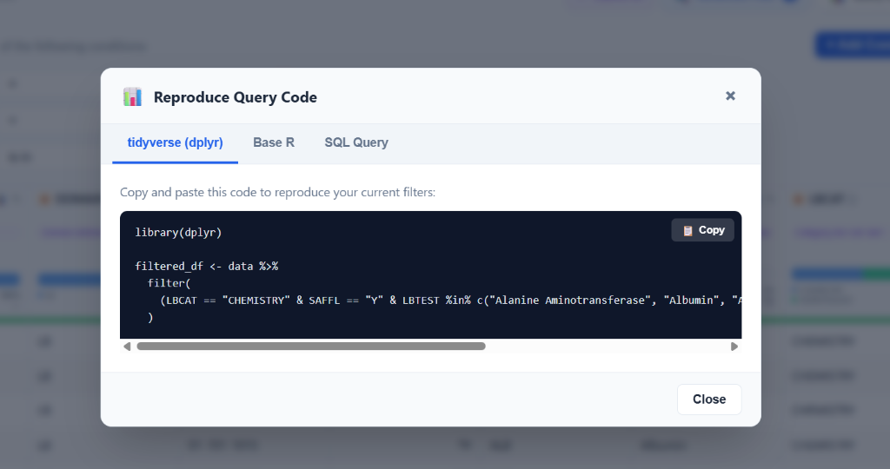
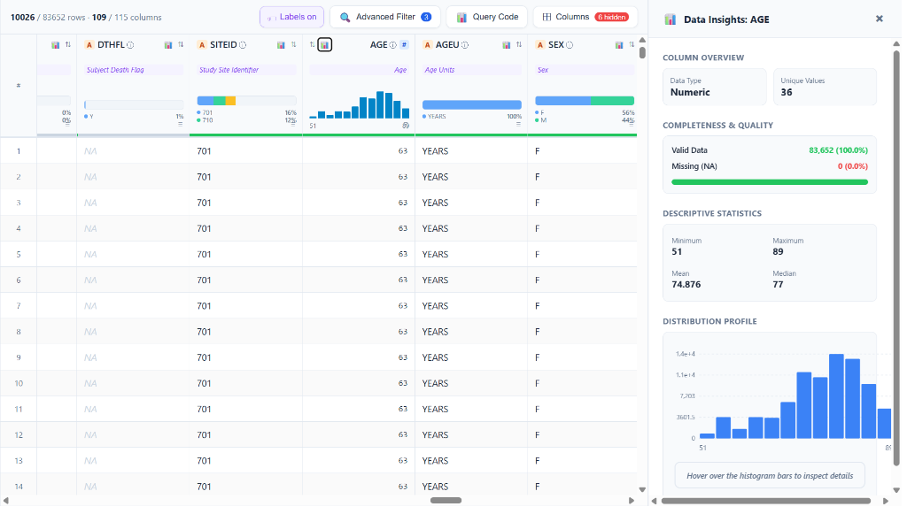
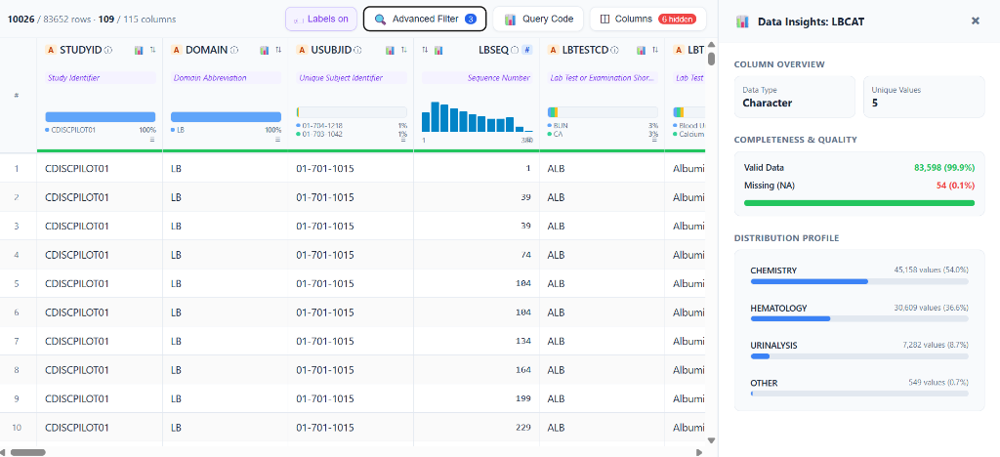

# dtsmartr 

**dtsmartr** is an interactive, Kaggle-style data explorer widget for R. Built with modern React and `htmlwidgets`, it provides a high-fidelity, ultra-responsive virtualized grid to browse, sort, filter, and extract insights from large datasets seamlessly.

It is designed to work beautifully inside the RStudio/Positron Viewer pane, embedded within Shiny applications, rendered in R Markdown/Quarto documents, or exported as standalone, portable HTML files for offline sharing.

---

### 🌐 Documentation & Website
For full step-by-step guides, feature articles, and reference documentation, visit our official package website:
👉 **[https://wagh-nikhil.github.io/dtsmartr/](https://wagh-nikhil.github.io/dtsmartr/)**

---

## 📦 Installation

### Stable CRAN Version
You can install the stable release version of `dtsmartr` from CRAN:
```r
install.packages("dtsmartr")
```

### Development Version (GitHub)
To install the latest development version containing all the modern features (such as Excel-style column resizing, text wrapping, and multi-column sorting) directly from GitHub:
```r
# install.packages("devtools")
devtools::install_github("wagh-nikhil/dtsmartr")
```

---

## 🎨 Visual Showcase (Real App Screenshots)

Below are actual, unretouched screenshots of **dtsmartr** in action, showing real dataset rendering and interactive visual metadata elements:

### 💡 Showcase 1: Premium Light Theme with Interactive Kaggle-Style Headers
Features mini distribution spark-histograms, type-safe data-type badges (like `#` for numeric), and column visibility pickers.


---

### 💡 Showcase 2: Sleek Dark Theme with Clinical Metadata & Variable Labels
Demonstrates full column labels inline, missingness progress bars (green/gray under the headers), active categories, and a professional dark palette perfect for low-light clinical analysis.


---

### 💡 Showcase 3: Virtualized Rendering of Massive Datasets (83,000+ Rows)
Shows real-time, lag-free scrolling across 83,652 rows and 115 columns of laboratory clinical data (`pharmaverseadam::adlb`). Top column headers and left row indexes remain perfectly sticky.


---

## 🖼️ Feature Gallery

### 🔌 Zero-Code Data Ingestion Wizard
Start the interactive ingestion wizard by running `dtsmartr_launch()` with no arguments (or using our one-click launchers). Designed specifically for non-programmers, it provides a beautiful drag-and-drop file uploader to ingest **CSV, Excel (.xlsx), SAS (.sas7bdat), or RDS** files. Once uploaded, users can inspect, verify, and custom-toggle column types/classes via the "View" and "Update" panels before feeding the clean dataset directly into the premium virtualized explorer grid!


---

### 🔎 Advanced Multi-Condition Query Builder
Build complex, multi-rule filters using `Match ALL (AND)` or `Match ANY (OR)` logic. Conditions support `=`, `is in`, `contains`, `<`, `>` operators with type-specific controls — including a **searchable multi-select checklist dropdown** for categorical columns (e.g. selecting 5 specific lab tests from `LBTEST`). The **Advanced Filter badge** shows the active filter count at a glance. Real-time row count (`10026 / 83,652 rows`) updates instantly as filters are applied.


---

### 💬 Column Metadata Tooltip Card (`ⓘ`)
Hovering over the **ⓘ info icon** next to any column name opens a floating metadata card with key statistics calculated directly from your dataset — no external dependencies required:
- **Total Rows** and **Unique Values** count
- **Missing (NA)** count with exact percentage
- **Descriptive Stats** for numeric columns: Min, Mean, Median, Max — rendered inline in a clean 2×2 stat grid

This example shows the `LBSEQ` (Sequence Number) column across **83,652 rows**, with **381 unique values** and only **40 missing** (0.0%), with Min = 1, Mean = 142.73, Median = 127, Max = 380.


---

### 📊 Reproducible Query Code Generator
Click the **Query Code** button to instantly generate copy-pasteable, production-ready R code that perfectly replicates your current filter and column state:
- **tidyverse (dplyr)**: Produces clean `%>% filter()` pipeline chains.
- **Base R**: Generates standard bracket-subset expressions.
- **SQL Query**: Generates portable ANSI SQL `WHERE` clauses.

The generator auto-substitutes your R variable name (e.g. `data`) and correctly formats `%in%` vector membership checks for multi-value `is in` conditions. A **Copy** button sends the entire block to the clipboard in one click.


---

### 📈 Data Insights Drawer — Numeric Column (Interactive SVG Histogram)
Click any column's mini spark-histogram or the Data Insights icon to slide open the **Data Insights side panel**. For **numeric columns**, it renders a full-width, interactive SVG distribution histogram featuring:
- **Column Overview**: Data type badge and unique value count
- **Completeness & Quality**: Color-coded valid data / missing (NA) progress bar with exact row counts and percentages
- **Descriptive Statistics**: Min, Max, Mean, Median in a clean 2×2 grid
- **Distribution Profile**: Full-width SVG histogram with hover-to-inspect functionality and Y-axis gridlines

This example shows the `AGE` column across 83,652 rows: **100% complete**, ages ranging from 51 to 89 years, Mean = 74.876, Median = 77.


---

### 📊 Data Insights Drawer — Categorical Column (Interactive Pareto Bar Chart)
For **character/categorical columns**, the Data Insights drawer renders a **horizontal Pareto bar chart** showing the distribution of the top categories with their exact value counts and percentages:
- **Column Overview**: Data type badge and unique value count
- **Completeness & Quality**: precise completeness metric (e.g. 99.9% valid / 0.1% missing)
- **Distribution Profile**: Proportional horizontal bars for each category, labeled with exact category name, value count, and percentage

This example shows `LBCAT` (Lab Test Category) with **5 unique values** across 83,598 valid rows: CHEMISTRY (54.0%), HEMATOLOGY (36.6%), URINALYSIS (8.7%), and OTHER (0.7%).


---

## 🚀 Key Features

### 1. High-Fidelity Virtualized Layout & Clinical Readability
- **Virtualized Grid Rendering**: Renders massive datasets (e.g., thousands of rows and high-dimensional clinical tables) instantly by only painting visible cells in the viewport, ensuring zero lag.
- **Sticky Coordinates**: Keeps top column headers and left row indices perfectly aligned and sticky during horizontal and vertical scrolling.
- **Clinical Alignment & Fonts**: strictly right-aligns all numeric column headers and cell values (using clean, monospace fonts like `Consolas` and `Fira Code` for numerical scanning) and left-aligns character columns. It automatically reverses the layout flex-direction for numeric headers to keep icons and labels beautifully balanced.
- **Sticky Row Pinning**: Click any row to lock/pin it with a distinct soft-gold highlight and a persistent sticky pin `📌` badge in the row index column, keeping vital subjects or records in view while scrolling across dozens of variables.
- **Missing Value Handling**: Represents missing values (`NA` / `null`) in elegant, italicized, muted-gray cells, with customizable placeholder string support (`na_string`).

### 2. Kaggle-Style "Micro-Dashboard" Column Headers
- **Missingness Progress Bar**: Renders a thin, color-coded progress bar at the very bottom of each header cell representing data completeness (Green: >95% complete, Amber: 50–95%, Muted Gray: <50%). Hovering displays a precise tooltip: `“{totalRows} values • {naCount} missing ({naPct}%)”`.
- **Mini Spark-Histograms**:
  - *Numeric/Datetime*: Renders a mini bar histogram showing the distribution profile with min and max labels.
  - *Character/Categorical*: Renders a color-coded mini horizontal stacked bar showing the top 3 most frequent categories, complete with a visual legend of the top 2 categories and their exact percentages.
- **Expanded Metadata Info Cards**: Tap the subtle `ⓘ` info icon next to any column name to open a detailed summary tooltip card showing total rows, unique values, and missing counts, along with:
  - *For Numeric*: Min, Mean, Median, and Max values (resolving the common median calculation bug).
  - *For Character/Categorical*: A beautifully styled HTML table detailing the Top 5 most frequent string values with exact counts and percentage breakdowns.

### 3. Collapsible Data Insights Side-Panel
- **Interactive SVG Visualizations**: Click the mini histogram inside any column header or detailed info card to slide open the collapsible `DataInsightsDrawer` side panel.
- **Interactive Histogram (Numeric)**: A full-sized distribution chart featuring dashed background gridlines, X/Y axes with numeric labels, and interactive hover bins. Hovering a bin highlights it and renders a tooltip showing its exact range, count, and percentage.
- **Interactive Pareto Bar Chart (Categorical)**: A beautiful wide-bar chart displaying the Top 5 to 10 categories, complete with hover highlights and detailed frequency tooltips.

### 4. Advanced Multi-Condition Query Builder
- **Dynamic Logical Rules**: Combine multiple advanced query conditions using global `Match ALL (AND)` or `Match ANY (OR)` connectors.
- **Searchable Checkbox Dropdowns**: The `is in` and `is not in` operators render a searchable checklist panel with helper links (`Select All` and `Clear`) to perform multi-category selection effortlessly.
- **Type-Specific Controls**: Numeric fields offer number inputs, datetime fields present interactive calendar date-pickers, and character fields use text search.

### 5. Reproducible Query Code Generator
- **One-Click Code Modal**: Tap the **📊 Query Code** button to reveal a tabbed modal generating the exact copy-pasteable code needed to replicate your active filter and column state.
- **Supported Syntaxes**: Outputs clean **tidyverse (dplyr)** pipelines, **Base R** subset operations, standard ANSI **SQL Queries**, **Arrow** collections, and **DuckDB / dbplyr** queries.
- **Active Column Projections**: If columns are hidden in the grid, the code generators dynamically append column selection projections (dplyr `select()`, Base R arguments, SQL lists, etc.) to project only visible column subsets.
- **Variable Name Auto-Extraction**: Automatically deparses and substitutes the R variable name (e.g. `adsl` or `adlb`) for copy-pasteable accuracy.

### 6. Zero-Code Data Ingestion Wizard & Performance Safeguards
- **Ingestion Wizard**: Launch `dtsmartr_launch()` with `data = NULL` to start an interactive file upload wizard powered by `datamods`. Drag and drop CSV, Excel, SAS datasets, or RDS files, verify column classes, and explore them instantly in a full-screen grid interface.
- **Automatic Viewer Cap Protection**: If a dataset exceeds 50,000 rows, `dtsmartr()` automatically reroutes rendering in interactive sessions to `dtsmartr_launch()` in an external browser, preventing RStudio or Positron IDE viewer pane freeze-ups. It gracefully warns and renders in-place if called inside a running Shiny app session.

---

## 📦 Installation

You can install the development version of **dtsmartr** directly from GitHub:

```r
# Install remotes if not already installed
if (!requireNamespace("remotes", quietly = TRUE)) {
  install.packages("remotes")
}

# Install dtsmartr
remotes::install_github("wagh-nikhil/dtsmartr")
```

---

## ⚡ Quick Start

### 1. Basic Interactive Data Browsing

Open any data frame in your default RStudio or Positron Viewer panel:

```r
library(dtsmartr)

# Explore the classic motor trend car road tests dataset
dtsmartr(mtcars)

# Browse with customized options, themes, and pre-hidden columns
dtsmartr(
  data = mtcars,
  options = dtsmartr_options(
    theme = "dark",
    hidden_columns = c("cyl", "hp"),
    na_string = "Missing"
  )
)
```

### 2. Clinical Dataset Exploration with Labels and Formatting

`dtsmartr` extracts R variable label attributes (commonly used in clinical data like ADaM datasets) and renders them inline inside the headers.

```r
library(dtsmartr)
library(pharmaverseadam)

# Explore Subject-Level Analysis Dataset (ADSL) with labels and active picker
dtsmartr(
  data = adsl,
  options = dtsmartr_options(
    theme = "auto",       # Adapts to IDE or system light/dark settings
    show_labels = TRUE,   # Displays labels (e.g. "Age", "Race", "Study Identifier")
    na_string = "—"       # Cleaner missing value indicator
  )
)
```

### 3. Launch Ingestion Wizard (Bypassing CORS & Freezes)

To start the file ingestion wizard or explore massive datasets in an external browser session:

```r
library(dtsmartr)

# 1. Start the zero-code ingestion wizard to drag-and-drop local files (CSV, XLSX, SAS, RDS)
dtsmartr_launch()

# 2. Explore a large dataset directly in your default browser
dtsmartr_launch(pharmaverseadam::adsl)
```

---

## 🖱️ One-Click & One-Line Launchers (For Zero-R / Non-R Users)

You don't need to know R to benefit from **dtsmartr**! The package includes three highly accessible, zero-code launching methods designed specifically for non-programmers, business analysts, or clinical researchers who prefer a simple click-and-run setup:

### 1. 🎯 The RStudio Add-in (One-Click GUI Solution)
Once the `dtsmartr` package is installed, a new launcher is registered directly in RStudio's top toolbar:
- Click the **Addins** dropdown menu in RStudio.
- Select **dtsmartr Data Explorer Wizard**.
- It immediately boots the Data Ingestion Wizard in your default web browser. No console typing required!

### 2. 💻 System Command-Line One-Liner (Terminal Solution)
Launch the wizard directly from your system's Command Prompt (Windows) or Terminal (macOS/Linux) without launching R manually:
```bash
Rscript -e "dtsmartr::dtsmartr_launch()"
```

### ⚡ 3. Desktop Shortcut Launcher (Double-Click Solution)
You can create a standalone Desktop shortcut to run **dtsmartr** like a native desktop app:
- **Windows**: Create a text file named `dtsmartr_explorer.bat` on your Desktop with these two lines:
  ```batch
  @echo off
  "C:\Program Files\R\R-4.4.3\bin\x64\Rscript.exe" -e "dtsmartr::dtsmartr_launch()"
  ```
  *(If your R version is different, simply replace the path above with your `Rscript.exe` location or standard `Rscript` if it is in your system PATH).*
- **macOS / Linux**: Create a shell script named `dtsmartr_explorer.sh` on your Desktop:
  ```bash
  #!/bin/bash
  Rscript -e "dtsmartr::dtsmartr_launch()"
  ```
  *(Make it executable with `chmod +x ~/Desktop/dtsmartr_explorer.sh`)*

Now, any team member can just **double-click the desktop icon** to instantly launch the secure local data browser, upload a CSV or Excel spreadsheet, and analyze it with premium aesthetics and visualizations!

---

## 💾 Saving HTML Reports & Avoiding Self-Contained Bloat

`save_dtsmartr()` exports any dataset as an interactive HTML grid report. The saved file runs completely offline in any browser without needing R or an active internet connection.

```r
library(dtsmartr)

# Save mtcars as a fully self-contained portable HTML report
save_dtsmartr(
  data    = mtcars, 
  file    = "outputs/mtcars_report.html", 
  options = dtsmartr_options(hidden_columns = "hp"),
  open    = TRUE
)
```

### 💡 How to Avoid Self-Contained Data Bloat (`selfcontained = FALSE`)

By default, `save_dtsmartr()` embeds all JavaScript libraries, CSS assets, and data directly inside the HTML file (`selfcontained = TRUE`), which requires Pandoc. 

For large datasets (e.g., thousands of rows) or environments without Pandoc, **setting `selfcontained = FALSE` is highly recommended**. This saves memory and outputs a lightweight HTML file alongside a companion directory containing the shared JS/CSS dependencies.

```r
library(dtsmartr)
library(pharmaverseadam)

# Save large ADLB clinical labs dataset without self-contained bloat
save_dtsmartr(
  data          = adlb, 
  file          = "outputs/adlb_report.html", 
  selfcontained = FALSE,    # Writes JS/CSS to 'outputs/adlb_report_files/'
  open          = TRUE      # Opens resolved HTML in default browser
)
```

| Parameter State | Output Files | Best Used For |
|---|---|---|
| `selfcontained = TRUE` (default) | A single, portable `.html` file | Email attachments and easy folder sharing. |
| `selfcontained = FALSE` | A lightweight `.html` file + `<file>_files/` companion directory | Large datasets (>20k rows), bulk exports, and systems without Pandoc installed. |

> [!NOTE]
> `save_dtsmartr()` passes `skip_routing = TRUE` internally to the main widget engine. This guarantees that large datasets like `adlb` (83k+ rows) are successfully written to disk as widget export files, bypassing the automatic external browser re-routing safeguard.

---

## 🛠️ Function Reference

### `dtsmartr_options(advanced_filter = TRUE, show_labels = TRUE, column_picker = TRUE, allow_export = TRUE, theme = "auto", na_string = "NA", hidden_columns = NULL)`
Helper function to customize UI display panels, themes, and default states.
- `advanced_filter`: Logical. Toggles advanced logical multi-condition query builder.
- `show_labels`: Logical. If `TRUE`, displays column attributes (like label description) inline in headers.
- `column_picker`: Logical. Displays column dropdown selector toggle.
- `allow_export`: Logical. Displays reproducible code query generation button.
- `theme`: UI appearance theme. Options are `"auto"`, `"light"`, or `"dark"`.
- `na_string`: Custom character string representing missing cells (defaults to `"NA"`).
- `hidden_columns`: Character vector of column names to hide by default on initial render.

### `dtsmartr(data, width = NULL, height = NULL, elementId = NULL, datasetName = NULL, options = dtsmartr_options(), skip_routing = FALSE)`
Creates the interactive virtualized htmlwidget grid.
- `data`: A `data.frame` to explore.
- `width` / `height`: Explicit widget dimensions. Defaults to full page container (`100%`).
- `elementId`: Optional static container ID.
- `datasetName`: Custom string representing the dataset in generated reproducible queries.
- `options`: Custom options list built using `dtsmartr_options()`.
- `skip_routing`: Logical. Internal bypass flag used by `save_dtsmartr()` to prevent >50k row routing.

### `dtsmartr_launch(data = NULL, port = NULL, options = dtsmartr_options())`
Spins up a temporary local background Shiny server to serve the grid or file upload uploader wizard in your default browser.
- `data`: A `data.frame` to explore, or `NULL` (default) to start the file uploader wizard.
- `port`: Optional numeric port.
- `options`: UI options constructed via `dtsmartr_options()`.

### `save_dtsmartr(data, file, selfcontained = TRUE, title = "dtsmartr", open = FALSE, background = "white", libdir = NULL, width = NULL, height = NULL, elementId = NULL, options = dtsmartr_options(), verbose = TRUE)`
Exports a `data.frame` as a fully interactive, standalone offline HTML file.
- `data`: A `data.frame` to explore.
- `file`: Path to the output HTML file.
- `selfcontained`: Logical. When `TRUE` (default), bundles all resources. When `FALSE`, creates a companion directory next to the file.
- `title`: Browser window / tab title.
- `open`: Logical. Open in default browser immediately after saving in interactive sessions.
- `options`: Custom options list built using `dtsmartr_options()`.

---

## 💻 Developer Setup (Rebuilding React Assets)

The frontend is implemented in React inside `srcjs/dtsmartr.jsx` and compiled with Webpack. To compile frontend changes:

```bash
# Navigate into the package directory
cd dtsmartr

# Install NodeJS dependencies
npm install

# Compile React resources into inst/htmlwidgets/dtsmartr.js
npm run build
```

Inside R, re-generate documentation, namespaces, and re-install:
```r
# Generate Rd manuals and NAMESPACE
devtools::document()

# Install the package locally
devtools::install()
```

---

## 📄 License

This package is licensed under the MIT License - see the [LICENSE](LICENSE) file for details.
